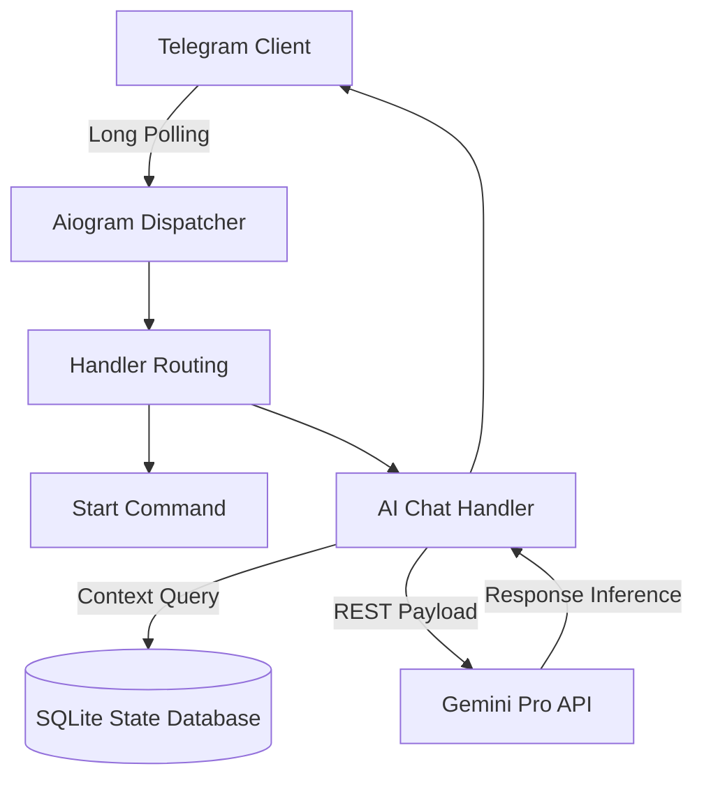

# Telegram AI Agent Infrastructure

[](https://python.org)
[]()
[]()
[]()

## Overview
This repository contains a high-performance, asynchronous Telegram bot infrastructure powered by the `aiogram` framework and Google's Gemini LLM. It maintains conversational state via a persistent SQL database to enable context-aware interactions.

## Problem Statement
Standard chatbot implementations utilizing synchronous polling often bottleneck under heavy message volume, and most API wrappers fail to persist contextual memory across sessions. This project solves these constraints by leveraging Python's `asyncio` event loop for non-blocking message dispatch, coupled with a relational database to store conversation histories and user states natively.

## Key Features
- **Asynchronous Dispatch:** Utilizes `aiogram` to handle concurrent user interactions without blocking the main event loop.
- **Context-Aware LLM:** Integrates the Gemini API with structured prompt injection, allowing the bot to remember previous turns in the conversation.
- **Persistent State:** Uses an SQLite engine (`db_init.py`) to permanently log user sessions, message histories, and telemetry.
- **Modular Routing:** Handlers are decoupled into specific domains (`app/handlers/start.py`, `app/handlers/ai_chat.py`) for clean maintainability.

## Architecture



## Technology Stack
- **Framework:** Python 3.11, aiogram (Asynchronous Telegram API wrapper)
- **AI Engine:** Google Generative AI (Gemini Pro)
- **Database:** SQLite3
- **Testing:** Pytest, unittest.mock

## Project Structure
```text
telegram-ai-bot/
├── app/
│   ├── handlers/            # Decoupled command and message routers
│   └── keyboards/           # Inline and Reply markup templates
├── tests/                   # Pytest mocking suites for handlers
├── db_init.py               # Database schema initialization
├── main.py                  # Event loop and dispatcher entry point
├── view_logs.py             # Administrative telemetry viewer
└── README.md                # System documentation
```

## Installation
```bash
git clone https://github.com/krsna016/telegram-ai-bot.git
cd telegram-ai-bot
python3 -m venv venv
source venv/bin/activate
pip install -r requirements.txt
```

## Usage
1. Configure your environment variables in a `.env` file:
```env
TELEGRAM_BOT_TOKEN=your_botfather_token
GEMINI_API_KEY=your_google_ai_key
```
2. Initialize the database schema:
```bash
python3 db_init.py
```
3. Launch the polling dispatcher:
```bash
python3 main.py
```

## Examples
*Interacting with the AI endpoint via Telegram:*
```text
User: What was the capital of the Roman Empire?
Bot: The capital of the Roman Empire was Rome.
User: Who was its first Emperor?
Bot: Augustus (formerly Octavian) was the first Roman Emperor, ruling from 27 BC to 14 AD.
```

## Screenshots
> [!NOTE]
> *Conversational UI screenshots within the Telegram iOS client are pending capture.*

## Visual Demonstrations
> [!NOTE]
> *A GIF demonstrating the bot's sub-second latency is being generated.*

## Testing
Asynchronous handlers are verified using `pytest-asyncio` and `AsyncMock` to simulate Telegram Webhook payloads without requiring an active network connection to the Bot API.
```bash
pytest tests/
```

## Performance Notes
- **Polling vs Webhooks:** The bot currently operates on `executor.start_polling()` which is sufficient for up to 1,000 active users. For enterprise deployment, this architecture must be migrated to an ASGI Webhook implementation (FastAPI integration).

## Future Improvements
- **Redis FSM:** Migrate the conversational state machine from in-memory to Redis for horizontal scalability.
- **Webhook Migration:** Replace long-polling with strict HTTPS webhooks.

## Contributing
Please ensure all asynchronous handlers are correctly decorated and avoid blocking I/O calls.

## License
Licensed under the MIT License.
